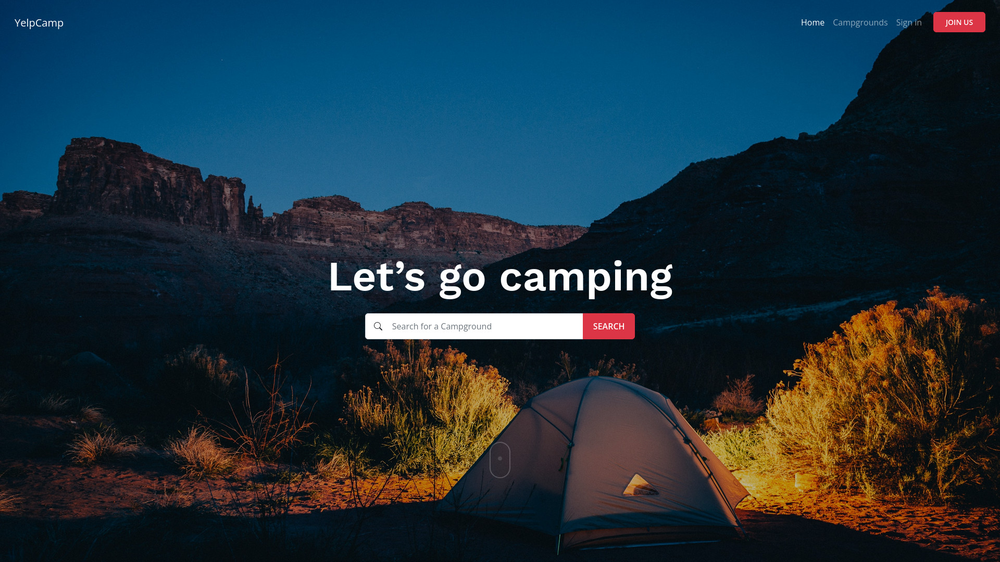

# YelpCamp

YelpCamp is the campground database created to connect people around the world.

> __NOTE:__ Click on the image to see it in action!

## Technologies used
- __Node.js__ (JavaScipript runtime environment)
- __Express__ (Web server)
- __EJS__ (Template engine)
- __MongoDB__ (Database)
- __JavaScript__
- __Sass__ (CSS preprocessor)
- __Bootstrap 5__ (CSS/JS library)

## Additional packages
- __Mongoose__ (MongoDB ODM)
- __Mapbox__ (Online maps)
- __Cloudinary__ (Image database)
- __Passport__ (Authentication)

## TODO
- [x] SEO optimization
- [x] Refactoring
- [x] Limit the campground description height to 4 rows on Campgrounds page.
- [x] Fix the layout overflow on small screens.
- [x] Vulnerability testing
- [ ] Improved star rating
- [x] Fix the timestamps on reviews & camps
- [ ] Image thumbnails
- [ ] Change the campground slug so it show an actual campground title
- [ ] Re-write in React and RTK
- [ ] Move the project to GitLab and set-up auto-deployment
- [ ] Night mode
- [ ] Ukrainian translation
- [ ] Add pagination to the campgrounds list
- [ ] Send an email when user submits a new campground
- [ ] Think of an alternative deployment platforms to increase performance
